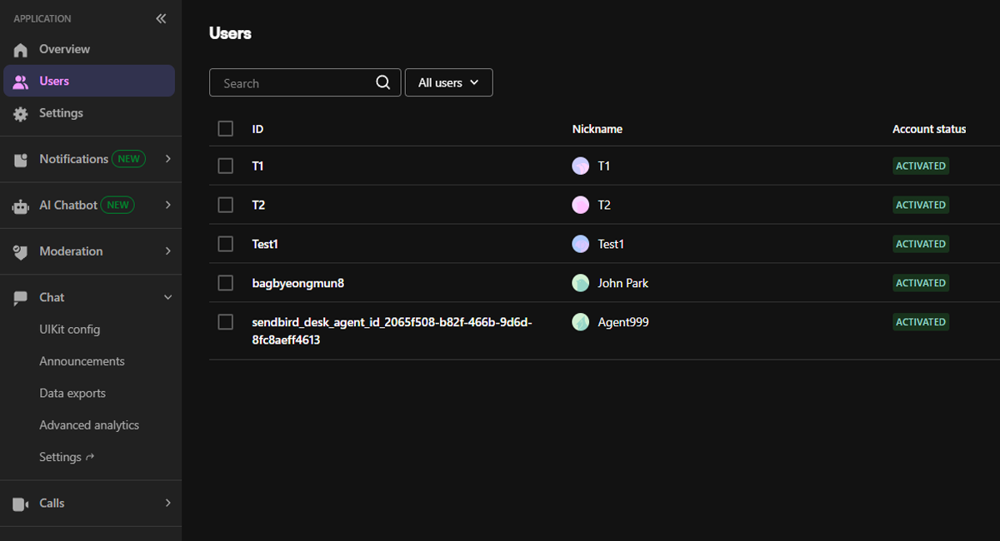
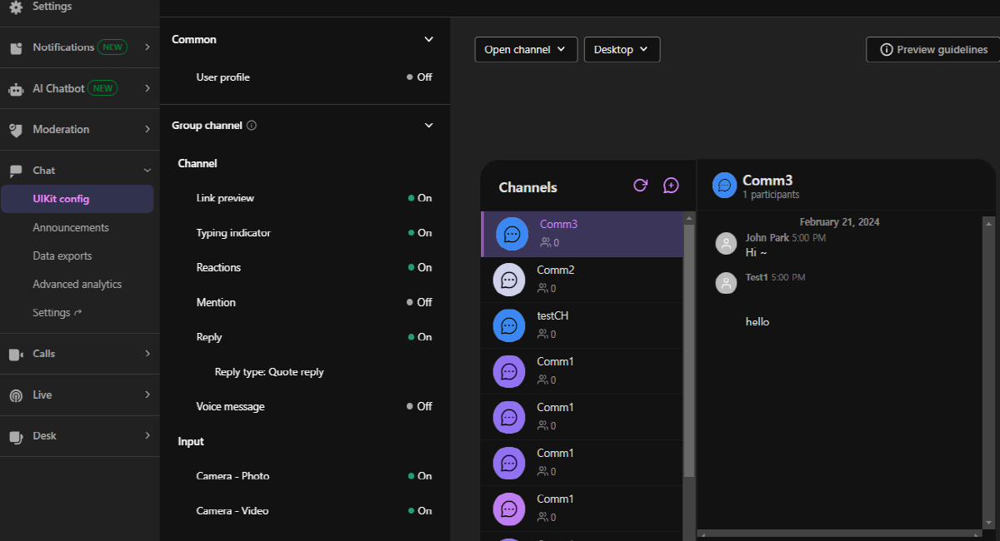
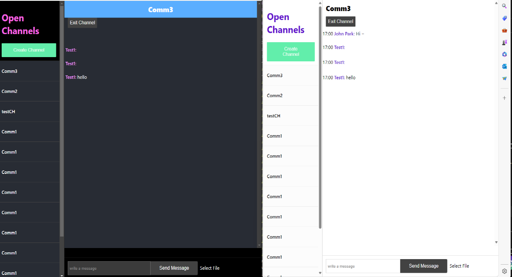
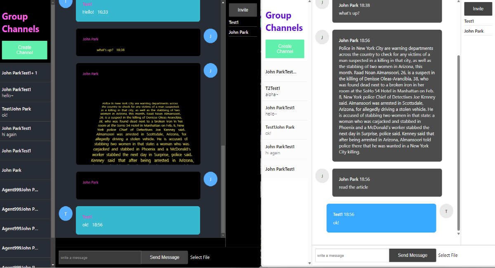
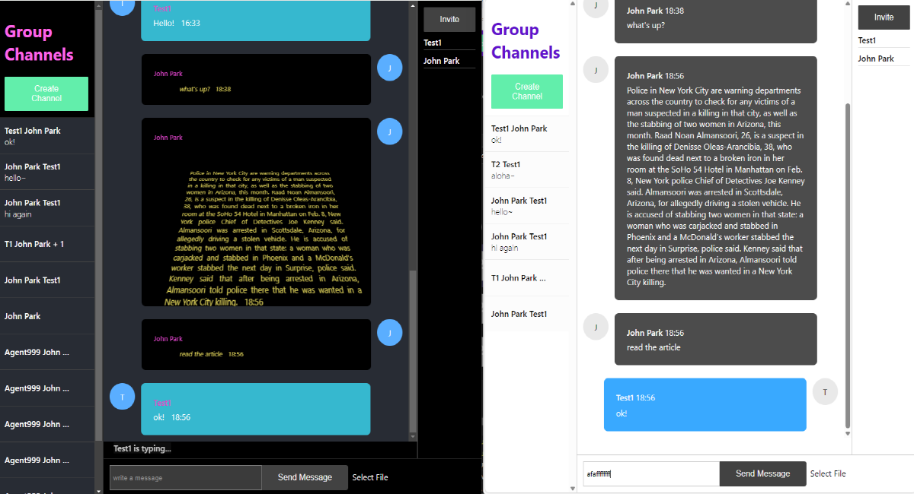
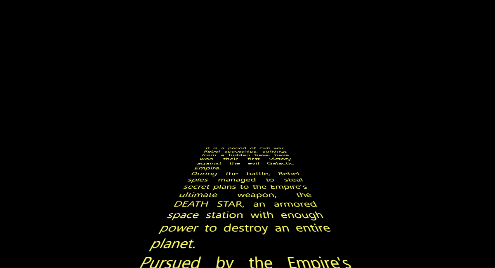
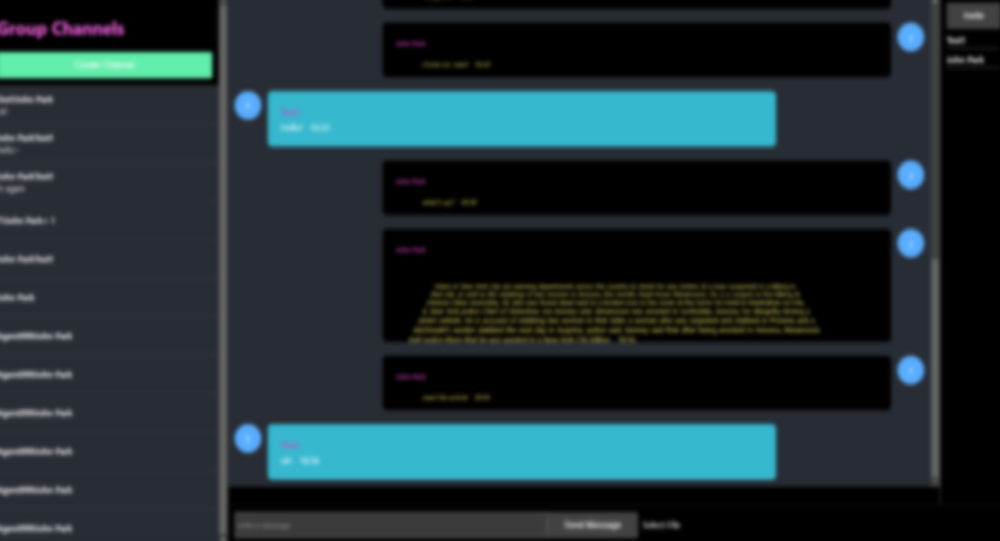
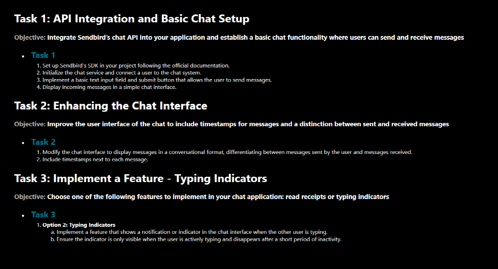

## How to set up
1. Ensure that Node.js is installed on your computer.
2. Download the source code.
3. Navigate to the base folder of the source code in the Command Line Interface (CLI).
4. Run the following commands in the CLI to generate a node_modules folder in the base folder:
`npm update`
5. Launch the web application at 'localhost:3100' by running the following commands in the CLI:
`npm start`

# Task-1
## How to implement
- For Task 1, created a mock-up utilizing Sendbird's sample code for basic open channel.
- Filter messages from senders to display only received messages in the list. 

    ```
    const messageSentByCurrentUser = message.sender.userId === sb.currentUser.userId;
    return (
        <div className="oc-message">
            {!messageSentByCurrentUser && <> {/*Chan: To show only received message from others in the list*/}
                <div className="oc-message-sender-name">{message.sender.nickname}{':'}</div>
                <div>{message.message}</div>
            </>}
    ```

## How to run and test



- Sign up for a Sendbird account to create an application and obtain an AppID, create users for testing, and generate tokens to activate the users.
- Create an open channel.


- Proceed with tests on two simple apps if an open channel is created and two users are activated with each token. Sendbird's dashboard can also be used as an application on one side.
- Two apps are used: one is the mockup for Task 1 created in this repository, and the other is Sendbird's dashboard in-app or basic-open-channel-sample. The former runs on localhost:3100, and the latter runs on localhost:3000 by default.



# Task-2
## How to implement
- For Task 2, created a mock-up utilizing Sendbird's sample code for basic group channel.
- Created a component for the sender's message text and added a timestamp code next to the text.

    ```
    const Message = ({ message, updateMessage, handleDeleteMessage, messageSentByYou }) => {
        ...
                <MessageText 
                    text={message.message}
                    timeStamp={timestampToTime(message.createdAt)}
                    messageSentByYou={messageSentByYou}/>              
            </div>
        );
    }

    const MessageText = ({ text, timeStamp, messageSentByYou }) => {
        return (
            <div className={`message-text  ${messageSentByYou ? 'text-from-you' : ''}`}>
                <div>{text} &nbsp; {timeStamp}</div>
            </div>
        );
    ````

## How to run and test
- Run two apps: one for this mock-up's Task 2 and another for Sendbird's basic-group-channel-sample (or use Sendbird's in-app chat in the dashboard).
- As authenticated and activated users of Sendbird's website, create channels for testing.



# Task-3
## How to implement
- For Task 3, create a mock-up utilizing Sendbird's sample code for basic group channel.
- Added an array for saving typing members in the state object.

    ```
    const [state, updateState] = useState({
	...
        typingMembers: [],
	...
    });
    ```

- Added code for channel handlers to get typing users with an update event in the current channel and update it into the state object.

    ```
    onChannelsUpdated: (context, channels) => {
        ....
                if (currentChannel) {
                    const members = currentChannel.getTypingUsers();
                    updateState({ ...stateRef.current, currentlyJoinedChannel: currentChannel, channels: updatedChannels, typingMembers: members });
    ```

- Added code to update typing members into state when joining a channel.

    ```	
    ...
        const { channels } = state;
        updateState({ ...state, typingMembers: [], loading: true });
    ```

- Added code to handle the typing state when changing message input.
    
    ```
    const onMessageInputChange = (e) => {
	...
        // Event should not be triggered if it is an update message in progress
        if (messageToUpdate === null) {
            messageInputValue !== "" ? currentlyJoinedChannel.startTyping() : currentlyJoinedChannel.endTyping();
        }
        updateState({ ...state, messageInputValue });
    }
    ```

- Added code to check typing done when sending messages 
    
    ```    
    const sendMessage = async () => {
	....
            currentlyJoinedChannel.sendUserMessage(userMessageParams)
                .onSucceeded((message) => {
                    currentlyJoinedChannel.endTyping();
    ```

- Added code to display a typing indicator with the number of typing members.

    ```
    const DisplayTypingIndicator = (typingMembers) => {
        let typingIndicatorText = ""

    typingMembers.length === 1 ? typingIndicatorText = typingMembers[0].nickname + " is typing..." :
        typingMembers.length === 2 ? typingIndicatorText = typingMembers[0].nickname + ", " + typingMembers[1].nickname + " are typing..." :
            typingIndicatorText = typingMembers[0].nickname + ", " + typingMembers[1].nickname + " and others are typing..."
    ```	
		
## How to run and test
- Run two apps: one for this mock-up's task3 and another for Sendbird's basic-group-channel-sample or (Sendbird's in-app for chatting in the dashboard).
- As authenticated and activated users of Sendbird's website, create channels for testing.



# Features and Designs
## 1. Landing page with animation effects and sounds in 'Starwars Intro'
- Added `Home.js` and `Home.css`
- The page redirects to the menu page during animation if there's a mousedown event.

    ```
      useEffect(() => {
        const handleMouseDown = () => {
          // Check if the CSS animation is still running
          if (animationRef.current && !animationRef.current.getAnimations().some(animation => animation.playState === 'running')) {
            // Redirect to the URL for the menu page
            window.location.href = 'http://localhost:3100/menu';
          }
        };

        // Add event listener for mouse down
        document.body.addEventListener('mousedown', handleMouseDown);
    ```


## 2. Screen Lock Function for Privacy Protection
- Set a timer for screen lock (default: 10 sec).
- The app's screen is blurred if there's no use for 10 sec.
- Unlock button provided.

    ```
    const App = () => {
      const getLockScreenUi = setLock => {
        return (
        ...
            <p>Just to be safe, we locked the screen</p>
            <button onClick={() => setLock(false)}>unlock</button>
          </div>
        );
      };

      return (
        <LockScreen timeout={20000} ui={getLockScreenUi}>
    ```



## 3. Navigation Links for Each Task on the Menu Page



## 4. Design Inspired by 'Starwars'
- Layout using Flexbox similar to Sendbird's sample app.
- Color and tone for Space mood.
- 'Starwars Intro' style in my messages sent.
- Animation effects in CSS.
- Auto replay and pause on mouse hover.
